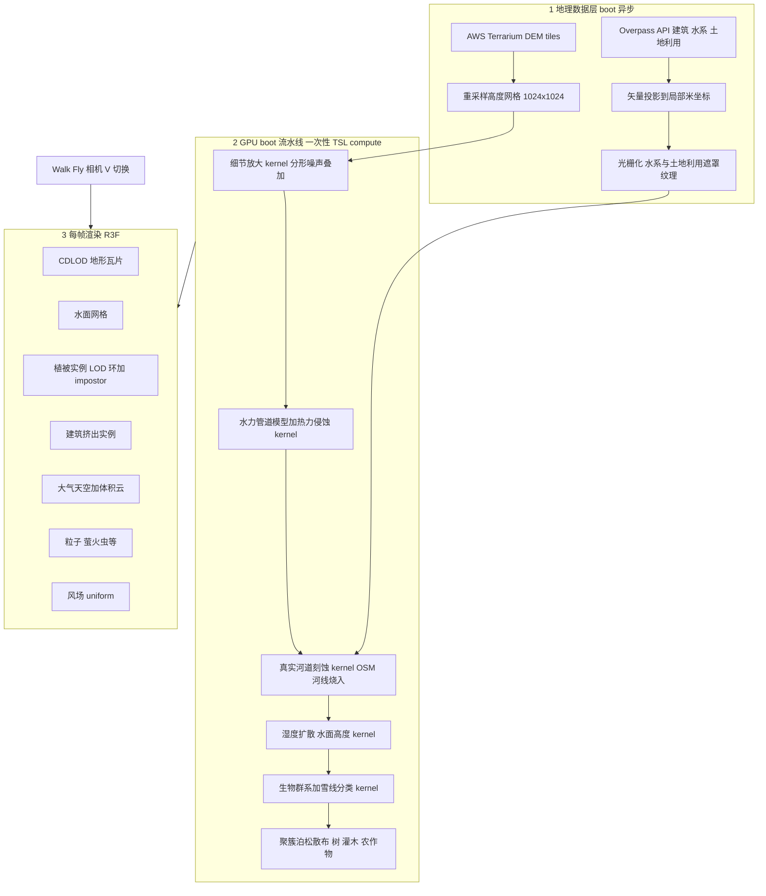

# 区域程序化地形引擎(useRegionScene)实施计划

> 参考 [fable5-world-demo (LAAS)](https://github.com/Braffolk/fable5-world-demo) 的 GPU 程序化世界技术,
> 在 three/webgpu + TSL + @react-three/fiber + @react-three/drei 上构建 `useRegionScene` Hook。
> 本文档随实现进度持续更新。

## 目标

构建一个可复用的 React Hook + 组件树,接受 **经纬度、渲染区域面积、模式(行走/飞行)、场景时段(白天/黑夜)**,
先拉取真实地理数据(免费 DEM + OSM),再以逐系统独立 TSL kernel 实时渲染区域场景:

地形 / 河流 / 湖泊 / 雪山 / 丘陵 / 森林 / 雨林 / 农田 / 沙漠 / 建筑 / 灌木丛 / 云彩 / 风 / 天空 / 萤火虫(粒子)。

首个落地场景:**川藏南线 · 成都站点**(30.57°N, 104.07°E,默认 4×4 km)。

## 已确认决策

| 决策点 | 结论 |
|---|---|
| 渲染后端 | WebGPU 优先(`WebGPURenderer`),初始化失败自动回退 WebGL2(`forceWebGL`);TSL 材质两端通用;依赖 compute 的侵蚀/水文 pass 在 WebGL2 下降级(跳过侵蚀,直接使用 DEM + OSM 河道 CPU 刻蚀) |
| 地理数据 | 免费无 Key:AWS Terrain Tiles(Terrarium 编码 DEM,~30 m)+ OSM Overpass API(建筑、水系、土地利用);IndexedDB 缓存 |
| 技术栈 | three 0.184(`three/webgpu` + `three/tsl`)、@react-three/fiber 9、@react-three/drei 10 — 均已安装 |
| 集成点 | `frontend/src/components/routes/experience/RouteScene.tsx` 由占位背景替换为真实 3D 场景 |

## 总体架构



## Hook API

```ts
useRegionScene({
  lat: number;            // 纬度
  lon: number;            // 经度
  sizeKm?: number;        // 渲染区域边长(km,默认 4)
  mode: "walk" | "fly";   // 第一人称行走 / 飞行
  timeOfDay: "day" | "night";
  seed?: number;          // 程序化细节种子(默认由经纬度导出,可复现)
})
// → { status, progress, error, world, groundProbe }
```

- `status`:`fetching-dem → fetching-osm → gpu-bake → building → ready | error`,驱动 boot 进度条。
- `world`:包含全部 THREE 对象(地形/水/植被/建筑/天空/云/粒子)的场景组,直接 `<primitive>` 挂载。
- `groundProbe(x, z) → { ground, water }`:CPU 高度镜像查询,供行走贴地与飞行软碰撞。

哪些要素被实例化由 **真实数据 + 生物群系分类** 驱动:成都激活平原农田/城市建筑/河流/竹林阔叶林;
雪山/沙漠/雨林 kernel 同样交付,由数据自动激活(理塘 → 雪线,敦煌 → 沙漠)。

## 目录结构(frontend/src/lib/region-engine/)

| 路径 | 内容 |
|---|---|
| `const.ts` / `types.ts` | 世界常量(尺寸、分辨率)与公共类型 |
| `geo/terrarium.ts` | Terrarium DEM 瓦片抓取 + 解码 + 双线性重采样 |
| `geo/overpass.ts` | Overpass 查询(建筑/水系/土地利用)+ IndexedDB 缓存 |
| `geo/project.ts` | WebMercator → 局部米坐标 |
| `geo/rasterize.ts` | 矢量 → 遮罩纹理(水体/河线距离场/流向/森林/农田/城区/沙地) |
| `gpu/noise.ts` | TSL 噪声/哈希工具(pcg2d、fbm) |
| `gpu/heightAmplify.ts` | 细节放大 kernel:DEM 宏观 + 分形微地形 |
| `gpu/erosion.ts` | 管道模型水力 + 热力侵蚀(移植 LAAS `Erosion.ts`,flux→water→erode→advect→thermal 五步 ping-pong) |
| `gpu/rivers.ts` | OSM 河线烧入刻蚀 + 水面高度 + 湿度扩散 kernel(逐河哈希唯一化河床/水深/流向) |
| `gpu/biome.ts` | 生物群系 + 雪线分类 kernel(温度×湿度×坡度×土地利用) |
| `gpu/pipeline.ts` | boot 编排(WebGPU compute 主路径 / WebGL2 CPU 降级路径)+ 高度回读 |
| `veg/species.ts` | 树种生长文法参数(竹/樟/杉/柳/桉 + 高原/沙漠种) |
| `veg/treeBuilder.ts` | 程序化树网格(骨架 + 叶簇,逐变体 seed) |
| `veg/scatter.ts` | 聚簇泊松散布(pcg2d(cell,salt) 哈希:种类/缩放/朝向/倾斜/色相,零克隆) |
| `veg/impostor.ts` | 远景 impostor 烘焙(boot 时渲染到纹理) |
| `render/terrainMaterial.ts` | 地形 splat 材质(宏-中-微三频、雪线、沙地、湿地暗化、云影) |
| `render/waterMaterial.ts` | 水面材质(菲涅尔 + 深度吸收 + 流向 flowmap 波纹 + 岸线泡沫) |
| `render/skyAtmosphere.ts` | 天空(日间散射渐变 + 太阳盘 / 夜间星空 + 月亮,昼夜平滑过渡) |
| `render/clouds.ts` | 云层(fbm 密度穹顶,随风漂移;地面云影同源) |
| `render/wind.ts` | 层级风 uniform(方向 + 阵风)供全部植被/粒子采样 |
| `render/buildingMaterial.ts` | 程序化建筑立面(白天墙面窗格 / 夜间窗光) |
| `camera/WalkFlyRig.ts` | 相机 rig(移植 LAAS `FlyCamera`) |
| `scene/*.tsx` | R3F 组件:RegionScene / TerrainTiles / WaterSurface / Forest / Shrubs / Farmland / Buildings / Clouds / SkyDome / Fireflies / AmbientParticles |
| `hooks/useRegionScene.ts` | 主 Hook(boot 编排 + 状态机) |

## 关键技术方案(对齐 LAAS)

- **地形**:DEM 提供宏观形态(替代 LAAS 的纯程序化合成),GPU kernel 做分形细节放大 +
  管道模型水力/热力侵蚀(五步 ping-pong,~250 迭代 @1024²);渲染用 CDLOD 四叉树
  (`SPLIT_K=2.1`、`PATCH_SEGS≈32-64`、skirt 裙边防裂缝、odd-vertex morph 防跳变)。
- **河流**:OSM 河道折线光栅化为距离场 + 流向场,烧入高度场刻蚀出河床;
  每条河以 riverId 哈希扰动深度/宽度/曲率;`fieldsTex` 存 moisture / flowStrength / riverDepth / flowDir;
  水面材质按流向做双相 flowmap 波纹。
- **植被唯一性**:每树种生成 4 个结构变体网格(逐变体 seed 驱动分枝文法),实例级再叠
  scale / yaw / lean / hue 哈希抖动(pcg2d(cell,salt) 确定性哈希)——任意两棵不同;
  散布用聚簇泊松(父簇场模拟光竞争)。
- **LOD**:近景真实网格 → 远景 impostor 广告牌;按 128 m 分块做距离环切换 + 视锥剔除;
  地形 CDLOD;云/天空恒定开销。
- **建筑**:OSM footprint 挤出(高度取 tags 或层数×3 m,缺省哈希),按块合并网格,
  程序化立面 TSL 材质(窗格、夜间窗光),距离淡出细节。
- **天空/时段**:日间散射渐变天空 + 太阳;夜间星空 + 月光;day/night 由 Hook 参数与工具栏
  Sun/Moon 驱动,平滑插值过渡。
- **萤火虫**:夜间激活的粒子系统(TSL 顶点 kernel 驱动漂移 + 呼吸式明暗,水边/植被密度加权分布);
  白天替换为花粉/飘叶粒子。
- **交互(与 LAAS 一致)**:`V` 切换 walk/fly;`WASD` 移动;fly 模式 `E` 升 `Q` 降、滚轮调速;
  walk 模式贴地(重力 22 m/s²、`Space` 跳跃、`Shift` 疾跑、步频头部摆动、落地下沉弹簧);指针锁定鼠标视角。

## WebGL2 降级说明(DEVIATIONS)

- 侵蚀与湿度扩散 compute kernel 需要 storage buffer 随机读写,WebGL2 后端不支持 →
  跳过侵蚀(DEM 本身已含真实侵蚀地貌),河道刻蚀/湿度/生物群系由 CPU 等价实现(同一套参数)。
- 散布与实例数据在 CPU 侧一次性生成(确定性哈希),两端一致——偏离 LAAS 的 GPU 散布 + indirect draw,
  换取双后端一致性;实例数据仍常驻 GPU(InstancedMesh),无逐帧 CPU 更新。
- Impostor 为单视角广告牌(非八面体 8×8 视图),在 300 m+ 距离观感可接受。

## 集成与交互

- `RouteScene.tsx`:挂载 R3F `<Canvas>`(WebGPU 异步初始化 → 失败回退 WebGL2 → 再失败显示诊断信息);
  boot 分阶段进度条(数据下载 → GPU 烘焙 → 场景构建)。
- 工具栏映射:first-person → walk(贴地)、third-person → fly;Sun/Moon → timeOfDay;
  场景内 `V` 键切换同步回工具栏状态。
- 站点:先做成都(30.57, 104.07,4×4 km,府河/沙河水系 + 城市建筑 + 平原农田 + 竹林/阔叶林)。

## 验收标准

1. 成都场景:真实高程起伏 + 河流水系 + OSM 建筑 + 农田/林地分布与真实数据一致
2. 树/灌木无克隆(任意两棵不同);河床/水深/流向逐河唯一;侵蚀痕迹可见(WebGPU 路径)
3. `V`/`WASD`/`E`/`Q`/`Space`/`Shift` 交互与 LAAS 一致,walk 模式贴地含重力与头部摆动
4. 白天/黑夜切换,夜晚出现萤火虫
5. 独立 TSL kernel/材质模块 ≥15 个,`npm run typecheck`、`npm run lint` 通过
6. 1080p 下 60 FPS(WebGPU 路径,中端独显)

## 进度

- [x] 计划调研与文档
- [x] 地理数据层
- [x] Canvas 接入与 boot 进度
- [x] 高度场 GPU 流水线
- [x] CDLOD 地形渲染
- [x] 水面系统
- [x] 天空/云/风
- [x] 植被系统
- [x] 建筑系统
- [x] 粒子系统
- [x] 相机 rig
- [x] 性能与验收(`PerformanceMonitor` 动态 dpr 分档 + dev `<Stats>` HUD;typecheck/lint 通过)
